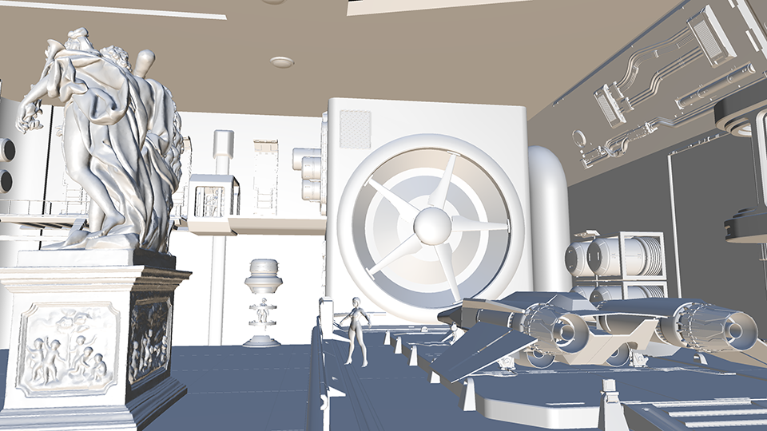

[< back](https://rashmatash.github.io)

# Light Culling with Approximate Sphere-Cone Intersection

A common practice for rendering scenes that contain a large number of local lights, is dividing the
screen space in square tiles and calculating which lights affect the pixels within each tile.
Common tile sizes are 8x8, 16x16 and 32x32 pixels. Since each tile covers a relatively small part
of the screen, it's most likely that the geometry rendered in a tile is only affected by a small
number of lights within the scene. The process of excluding all lights that don't affect the geometry
within each tile is called tile-based light culling.

[](images/2305-grid-frustums.png)   
<sup>Figure 1: The screen space is divided in a grid which is used to bin lights that intersect each tile frustum.</sup>

The list of lights for each tile can be used in a pixel shader while rendering the geometry. 
When the pixel shader is calculating a pixel color, it only has to include the lights that affect the
square where the current pixel belongs to. This method is widely referred to as Forward+ rendering.<sup>[1](#references)</sup>

Obviously, the more accurate light culling is, the fewer lights remain for a pixel shader to process,
and therefore, the faster the shading will be. However, accurate culling has a cost that needs to be
balanced against the cost of shading.

In this article, I'll explain how the light culling compute shader is implemented in Primal Engine,
and how the general shortcomings of tile-based light culling (outlined below) are addressed.

## Base implementation

Forward+ rendering is done in following steps:

- Construct a grid of frustums. The four frustum walls/planes are calculated from the corners of
each tile in view space.
- Determine the minimum and maximum depth of pixels within each tile. These are used to construct
the front and back planes of each frustum.
- Test intersection of all lights with each frustum and record the number and indices of intersecting
lights.
- Use this list of lights for each pixel in the corresponding tile to calculate lighting in pixel shader.

Our first implementation of the light culling compute shader is based on [[3dgep, 2]](#references). In this
approach, the frustum grid is constructed using a separate compute step. The four planes of all frustums are
written into a buffer which is then accessed by the light culling compute shader. In the culling step,
interlocked min/max instructions are used to determine the minimum and maximum depth for each tile. Next,
we loop through the list of lights and check each light against the six planes of the frustum. The two light types
that are implemented are point lights and spotlights. Because of their limited range, these light rarely affect
everything in view of the camera, and therefore, can be culled from tiles where they have no effect.

Point lights are culled using six sphere-plane intersection tests. Spotlights are culled using six cone-plane
intersection tests. Because each intersection function is different, we need to use an if-statement to
call the right intersection testing function for each light type:

```cpp
for (light : lights)

    if (light.type == pointlight && 
        pointLightTest(light.boundingSphere, frustum)

          addLight(light)

    else 
    if (light.type == spotlight &&
        spotlightTest(light.cone, frustum)
       
       addLight(light)

    end if
end for
```
<sup>Listing 1: Pseudo code for intersection testing loop using frustum-sphere and frustum-cone intersection tests.</sup>


If a light intersects the frustum, its index is added to a list and the number of intersecting lights
is incremented by one.

## Performance

The _total frame time_ for rendering our test scene using different numbers of lights is shown below. This
frame time is measured for 1920x1080 HD and 3840x2160 4K resolutions. At this point, I'm interested in what
the performance behavior is **_only_** for light culling step. So, I decided to skip everything after light
culling and only visualize the light count per tile. So, the total frame time consists of only the depth prepass,
light culling pass and light count visualization. There's no shading/lighting pass. The tile size in all
measurements in this article is always 32 pixels (1024 threads per group).

The rendering is done using a single thread on an AMD Ryzen 3950X and RTX 2070 Super graphics card. The light
sizes are small to average (1 to 5 meters). About half of the lights is a point light and the other half is
spotlight.

[](images/2305-base-light-culling-performance.png)    
<sup>Figure 2: Total frame time in milliseconds (vertical axis) as a function of light count (horizontal axis)
for the base implementation.</sup>

[](images/2305-test-scene.png)   
<sup>Figure 3: Test scene rendered with directional lights only.</sup>

[](images/2305-base-18k-lights-4k.png)   
<sup>Figure 4: Light count heatmap of 18000 lights at 4K resolution for base implementation.</sup>

[](images/2305-base-64k-lights-4k.png)   
<sup>Figure 5: Light count heatmap of 64000 lights at 4K resolution for base implementation.</sup>

[](images/2305-test-scene-lights.png)   
<sup>Figure 6: Test scene rendered with 64000 point lights and spotlights in the scene volume.</sup>

As expected, large numbers of lights can be used within a scene without slowing down too much. One question
that's raised immediately is, what could we expect for the number of lights in a typical game. The short answer
is, of course, that we can't know beforehand. However, we can make a guestimate by looking at contemporary
games, which tend to have anything between tens and a few thousands of lights per scene. There are games
that have no cullable lights and also games with tens of thousands of lights, but I think it's a good idea
to have the main use-case in mind when considering performance.

Looking at the frame time when we have a few thousand lights or less, we see that the extra time spent on
light culling is perfectly acceptable and within a few milliseconds. However, when we have a 16.67 ms frame
budget, each millisecond we can save means a 6% performance increase. So, can we shave some milliseconds off
of the frame time?

The source article that explained the concept of Forward+ rendering,<sup>[2](#references)</sup> was written,
and rightly so, with clarity in mind in order to maximize its educational value. So, it wouldn't be surprising
if there remain opportunities to squeeze more out of the GPU. We can consider the following while looking
for ways to optimize:

- **algorithm efficiency:** minimize computations and eliminate branching (only works if not memory bound).
- **memory usage:** minimize data sizes, split data types into multiple buffers.
- **culling accuracy:** spend a bit more time on culling which will save a ton of lighting calculations in
the pixel shader.
- **take advantage of hardware characteristics:** groupshared vs register memory, bank conflicts, etc.

Let's have a look at a few possibilities.

### The frustum grid

The step where the frustum grid is calculated, is only necessary when either the render target dimensions or
the camera's field of view have been changed, because these are the only parameters the frustum grid depends on.
So, unless we're changing the window size or the camera's field of view frequently, it shouldn't have a big
hit on frame time. However, each frustum is described using four planes and each plane is expressed in normal-distance
form, which takes 16 bytes. So each frustum needs 64 bytes in GPU memory. For an HD resolution there
are 8160 frustums (assuming 16x16 tile size) and hence, about 0.5MB of GPU memory is needed. This is not large
at all, but if we consider that the light culling shader needs to read this memory for all lights, it's not
hard to imagine that we could get some performance benefits by compactifying the frustums buffer.

### Min/max depth calculation

The minimum and maximum depth for each tile are calculated in the light culling shader using groupshared memory
and atomic interlocked min/max functions. Using interlocked functions is relatively slow because of the
memory synchronization. An often proposed improvement is to have a separate pass that uses parallel reduction
which avoids using interlocked operations.<sup>[4](#references)</sup> A simpler
way of improving the performance is using the wave intrinsic functions which are available since SM6.0.
Obviously, this will limit the engine to devices that support SM6.0 or later (see listing 2).Although, both
methods are pretty much guaranteed to save a few tenths of milliseconds, I don't think it's the biggest win in
the base implementation.

```hlsl
const float C = GlobalData.Projection._m22;
const float D = GlobalData.Projection._m23;

// ...

// Don't include far-plane (i.e. no geometry).
if(depth != 0) // Reversed depth buffer
{
    const uint depthMin = WaveActiveMin(depth);
    const uint depthMax = WaveActiveMax(depth);
    
    if (WaveIsFirstLane())
    {
        // Negate min/max because of right-handed coordinates (negative z).
        // This makes the comparisons easier understand.
        const uint zMin = asuint(D / (depthMin + C)); // -minDepthVS as uint
        const uint zMax = asuint(D / (depthMax + C)); // -maxDepthVS as uint
        // Swap min/max because of reversed depth (0 is far-plane, 1 is near-plane).
        InterlockedMin(_minDepthVS, zMax);
        InterlockedMax(_maxDepthVS, zMin);
    }
}
```
<sup>Listing 2: Using SM6.0 wave intrinsic functions to reduce interlocked operations.</sup>

### Intersection functions

By far, the most expensive part of the light culling shader is testing whether a light intersects with a frustum.
In the base implementation, each thread reads light data for a single light from a buffer and depending on
the light type, a function is called to do sphere-plane or cone-plane intersection testing. The first obvious
performance hit is the conditional branching per light type. Second, the light data structure is quite big:

```hlsl
struct LightCullingLightInfo {
    float3 Position;    // light position for point light and spotlights
    float  Range;       // light range in world space units
    float3 Direction;   // light direction, only applies to spotlights
    float  ConeRadius;  // radius of the spotlight cone base
    float  Type;        // light type: point light or spotlight
    float3 padding;     // padding to make struct size 16 byte aligned.
};
```
<sup>Listing 3: Data passed to light culling compute shader</sup>

This is a 48 byte structure multiplied by the number of lights in a buffer which is read in its entirety by every
thread group. In our implementation we have as many thread groups as there are frustums. A back-of-the-napkin
calculation for HD resolution and 1000 lights, shows that the buffer is going to be read 8160 times, resulting in
390MB per frame (23GB/s @ 60FPS).

Third (yes, we're not done yet), intersection algorithms can be costly. We can check if a bounding sphere that
envelopes a point light intersects with a frustum using a few if-branches and a maximum of four dot-products. This is
relatively cheap. For spotlights, however, we need to calculate the closest point to each plane of the frustum
which is computationally more expensive. Also, a cone is not a great bounding volume for spotlights, because spotlights
are more like a section of a sphere rather than a cone (see figure 7). This leads either to artifacts for wide
cone angles or large amount of false positives.

[](images/2305-bounding-cone.png)   
<sup>Figure 7: Using a cone as bounding volume for spotlights works best if spotlight cone angle is less than
90 degrees (left). Taking the base height of the spotlight would result in a partial bounding volume (center).
Using the spotlight cone angle directly would result in very large bounding cones with a lot of false positive
space (right).</sup>

When a light is included in a tile while it doesn't affect any pixels within that tile, it's called a false
positive. There are mainly two types of false positives when using this kind of light culling: intersection
false positives and depth discontinuity false positives.

### Intersection false positives

Using plane intersection testing to determine if a bounding volume, such as a sphere or cone, intersects with a frustum
works well when the frustum is large compared to the bounding volume. Frustums in the frustum grid, however, are rather
narrow shaped, while the light bounding volumes can be large in comparison. It is then easy for a bounding volume to be
on the "inside" of two frustum planes, while not intersecting with the frustum at all (see figure 8). As a result,
this method of intersection testing effectively generates a screen-space bounding rectangle for each light, incorrectly
including it in tiles where the light has no effect. Consequently, the pixel shader will perform unnecessary lighting
calculations, negatively impacting the performance.

[](images/2305-intersection-false-positive.png)   
<sup>Figure 8: The bounding sphere is entirely on the positive half space of planes A and B. It's also partially in
the positive half space of planes C and D. Therefore, it's accepted as a light that intersects the frustum
(green square), while it clearly doesn't.</sup>

We could construct an axis-aligned bounding box (AABB) for each frustum and use it for intersection testing instead
of the frustum planes. For short frustums (i.e. tiles with a small difference in depth min/max), this would yield good
results. However, for longer frustums the volume of the AABB becomes rather large which again results in an increase
of false positives.<sup>[3, 4](#references)</sup> In addition, constructing AABBs isn't for free either.

### Depth discontinuity false positives

The extents of each frustum are determined using the minimum and maximum depth values of the pixels within each tile. Therefore,
lights that intersect a frustum are included, even if they didn't affect any geometry in that tile. This happens, for
example, when there are large empty spaces between objects in the direction of the camera. In other words, lights are
incorrectly included in a tile when there are large depth discontinuities in a tile (see figure 9).

[](images/2305-depth-false-positive.png)   
<sup>Figure 9: The yellow lights are culled since they don't intersect with any frustum. The green lights are kept and
they do actually affect visible geometry. The red lights are also kept, but they don't lit any geometry. These are
false positives due to depth discontinuity.</sup>

There are various approaches to improve culling accuracy for tiles with large depth discontinuity. The (modified)
half-z<sup>[4](#references)</sup> and 2.5D culling,<sup>[3, 6](#references)</sup> are a few examples.

## Using cone frustums

Initially, I wanted to increase the culling accuracy by minimizing intersection false positives. The first idea that
comes to mind is to consider other possibilities to define a tile in screen-space. One way of doing it, would be to
construct a grid using overlapping circles instead of tiles. In view space, the circles will become cones that originate
from camera's position. The idea is that, because we're not dealing with planes anymore, we could hopefully do better
intersection testing with fewer false positives.

[](images/2305-circle-tiles.png)   
<sup>Figure 10: We can try using circles that envelope each tile. These circles will extend to cones in 3D space.</sup>

Having cones instead of frustums means that now we have to do cone-sphere and cone-cone intersection testing for point
lights and spotlight, respectively. Doing a quick search for mathematical methods to do these tests, I found
[[Eberly, 5]](#references) for cone-sphere intersections. However, I couldn't find anything on cone-cone intersection
and I'm not quite sure if it's even possible to do it in a practical way. Even the cone-sphere intersection testing
in [[5]](#references) seems to be way to expensive to be practical. On the other hand, it is the mathematically correct
way of determining if a cone and a sphere intersect. The keyword here is "correct". As with many topics in graphics
programming, we can often get away with approximating a model that would otherwise be too costly to compute. The
question is if we can think of a good enough approximation for sphere-cone intersections in terms of accuracy and
performance.

### Sphere-cone intersection approximation

Trying to come up with a simpler intersection method, I used a naïve mental model of a sphere and a cone (see figure
11). If we know the length of the cone (L), its base diameter (R), and how far the sphere's center is along the cone's
axis (M), we can scale the base diameter to get the radius of the cone circle (r) at sphere's position. The sphere
intersects the cone if the sphere and the cone circle touch or overlap. We can simply test this by adding the sphere radius
and cone circle's radius and comparing the result to sphere's distance (D) from the cone axis.

[](images/2305-sphere-cone-intersection.png)   
<sup>Figure 11: Sphere intersects cone if $D \le C_r + r$</sup>

Looking closely at the intersection of a sphere with a cone as depicted in figure 12, shows us that the point where
the sphere touches the cone mantel is not directly on the line from sphere's center to its projection on the cone.
This is more evident if we look at a cone with a wider angle. As a result, the sphere could be touching the cone,
while our intersection function's result is negative.

[](images/2305-sphere-cone-correct-intersection.png)   
<sup>Figure 12: Correct sphere-cone intersection. The sphere touches the cone at point T. Note that the deviation from
our approximation is reduced as cone's half angle $\alpha$ gets smaller.</sup>

Although this calculation is geometrically wrong, it can still be used as an approximation to the correct sphere-cone
intersection function, for this specific use-case, because of the following reasons:

1) The frustums used in light culling have a narrow angle which minimizes the intersection error. For an HD resolution,
32 pixel tiles and a vertical field of view of about 60 degrees, each frustum has a half angle of 0.9 degrees. This
hardly makes any difference in the point where the sphere really touches the cone versus our approximation.
2) The cone is already a loose fit for the actual frustum. Except for frustum edges, the cone is always a bit larger
which means that spheres touch the cone before they touch the frustum.
3) Even if the intersection function just barely misses (i.e. a false negative), it happens at the very end of the light's
effective range, where the light intensity is next to zero and imperceptible.

We can use a simple compute shader to generate the grid of frustum cones:

```hlsl
struct Frustum {
    float3  ConeDirection;
    float   UnitRadius; // max cone radius divided by cone height.
};

[numthreads(TILE_SIZE, TILE_SIZE, 1)]
void ComputeGridFrustumsCS(uint3 DispatchThreadID : SV_DispatchThreadID)
{
    // Return if our thread ID is not in bounds of the grid
    if (DispatchThreadID.x >= ShaderParams.NumThreads.x || DispatchThreadID.y >= ShaderParams.NumThreads.y) return;

    const float2 invViewDimensions = TILE_SIZE / float2(GlobalData.ViewWidth, GlobalData.ViewHeight);
    const float2 topLeft = DispatchThreadID.xy * invViewDimensions;
    const float2 center = topLeft + (invViewDimensions * 0.5f);

    // Unproject normalized screen-space coordinates to view space.
    float3 topLeftVS = UnprojectUV(topLeft, 0, GlobalData.InvProjection).xyz;
    float3 centerVS = UnprojectUV(center, 0, GlobalData.InvProjection).xyz;

    // Using y-up right-handed coordinate system and reversed depth buffer.
    const float farClipRcp = -GlobalData.InvProjection._m33;
    Frustum frustum = { normalize(centerVS), distance(centerVS, topLeftVS) * farClipRcp };

    // Store the computed frustum in global memory for thread IDs that are in bounds of the grid.
    Frustums[DispatchThreadID.x + (DispatchThreadID.y * ShaderParams.NumThreads.x)] = frustum;
}
```
<sup>Listing 4: Generating the grid of frustum cones.</sup>

Note that this is both computationally cheaper and results in a much compacter buffer compared to storing four planes
for each frustum. Now we can use the following function for sphere-cone intersection testing:

```hlsl
struct Sphere {
    float3  Center;
    float   Radius;
};

bool Intersects(Frustum frustum, Sphere sphere, float minDepth, float maxDepth)
{
    // NOTE: sphere center is in view space
    if ((sphere.Center.z - sphere.Radius > minDepth) || (sphere.Center.z + sphere.Radius < maxDepth)) return false;

    const float3 lightRejection = sphere.Center - dot(sphere.Center, frustum.ConeDirection) * frustum.ConeDirection;
    const float distSq = dot(lightRejection, lightRejection);
    const float radius = sphere.Center.z * frustum.UnitRadius + sphere.Radius;
    const float radiusSq = radius * radius;

    return distSq <= radiusSq;
}
```
<sup>Listing 5: The approximate sphere-cone intersection function.</sup>

Using this function has about the same cost as the old frustum-sphere intersection test which used planes. However,
it results in fewer false positives. In addition, it's significantly faster than the frustum-cone intersection function
(see [[2]](#references)). Speaking of which, how do we handle spotlights now? Well, since we don't have a cone-cone
intersection function, we can construct a bounding sphere for our spotlights and use it for intersection testing:

```cpp
Sphere CalculateConeBoundingSphere(float3 lightPostion, float3 lightDirection,
                                   float lightRange, float cosPenumbra)
{
    const float tip{ lightPosition) };
    const float direction{ lightDirection) };
    const float range{ lightRange };
    const float coneCos{ cosPenumbra }; // cosine of half angle of penumbra
    assert(coneCos > 0.f);

    Sphere sphere{};

    // If cone half-angle is less than 45 degrees
    if (coneCos >= 0.707107f)
    {
        sphere.Radius = range / (2.f * coneCos);
        sphere.Center = tip + sphere.Radius * direction;
    }
    else
    {
        sphere.Center = tip + coneCos * direction;
        const float coneSin{ sqrt(1.f - coneCos * coneCos) };
        sphere.Radius = coneSin * range;
    }

    return sphere;
}
```
<sup>Listing 6: Computing bounding spheres for a spotlight.</sup>

This can be done on the CPU side when a spotlight is created, or when we change any of spotlight properties that affect
its bounding sphere. This has the added benefit of reducing the culling info struct (see Listing 1), resulting in a much
smaller buffer that only contains bounding spheres (16 bytes per light). In addition, the branching in the intersection 
loop is no longer necessary:

```cpp
for (light : lights)
    if (intersects(light.boundingSphere))
        addLight(light)
    end if
end for
```
<sup>Listing 7: Pseudo code for intersection testing loop using bounding spheres.</sup>

Obviously, the intersection tests for spotlights do have false positives. However, the culling shader is now so much
faster that we can afford to spend a couple of cycles to remove the false positives. We can do this together with
correcting for lights that are included because of depth discontinuities. As mentioned before, there are
a few methods available for additional culling (half-z and 2.5D culling). However, considering the fact that the number
of lights per tile after intersection testing is typically low, it's rather likely that simply checking if the lights
that affect a tile also affect _all_ pixels within the tile wouldn't be much more expensive. I didn't compare the
performances for different methods, but chose the simplest solution (for my brain) instead. Therefor, I added an
extra `groupshared` array of integers with the same length as light-index list. Then for each pixel in the tile,
we loop through all lights affecting that tile and flag each light that also affects the pixel. The lights that are
not flagged by any pixel are culled.

```hlsl
groupshared uint _lightIndexList[MaxLightsPerGroup];
groupshared uint _lightFlags[MaxLightsPerGroup];

// ...

// This is done for each pixel (each thread in light culling shader).
if (lightCount != 0 && depth != 0)
    {
        const float2 invViewDimensions = 1.f / float2(GlobalData.ViewWidth, GlobalData.ViewHeight);
        // Get pixel's world position:
        const float3 pos = UnprojectUV(csIn.DispatchThreadID.xy * invViewDimensions, depth, GlobalData.InvViewProjection).xyz;

        for (i = 0; i < lightCount; ++i)
        {
            if (_lightFlags[i] != 0) continue;

            index = _lightIndexList[i];
            LightCullingLightInfo light = Lights[index];
            const float3 d = pos - light.Position;
            const float distSq = dot(d, d);

            if (distSq <= (light.Range * light.Range))
            {
                // NOTE: -1 means the light is a point light. It's a spotlight otherwise.
                const bool isPointLight = light.CosPenumbra == -1.f;
                if (isPointLight || (dot(d * rsqrt(distSq), light.Direction) >= light.CosPenumbra))
                {
                    // Encode light type in flag (1 for point light, 2 for spotlight).
                    _lightFlags[i] = 2 - uint(isPointLight);
                }
            }
        }
    }
```
<sup>Listing 8: for each pixel in the tile, loop through all lights affecting that tile and flag each light that
also affects the pixel.</sup>

Note that we do have to encode the light type in `CosPenumbra` since we're not passing the light type with the
culling information anymore. Because the cosine of the half angle is always positive, we can give it a negative
value whenever the light is a point light.
Additionally, we can sort by light type using the flag value, so that we can write the point lights to the buffer
first, followed by spotlights. This way, we eliminate branching in the pixel shader which can have a loop for
calculating lighting for point lights, followed by another loop for spot light.

The entire culling shader is as follows:

```hlsl
static const uint       MaxLightsPerGroup = 1024;

groupshared uint        _minDepthVS;
groupshared uint        _maxDepthVS;
groupshared uint        _lightCount;
groupshared uint        _lightIndexStartOffset;
groupshared uint        _lightIndexList[MaxLightsPerGroup];
groupshared uint        _lightFlags[MaxLightsPerGroup];
groupshared uint2       _lightIndex; // x for point lights and y for spotlights.
groupshared uint        _spotlightStartOffset;

ConstantBuffer<GlobalShaderData>                GlobalData                  : register(b0, space0);
ConstantBuffer<LightCullingDispatchParameters>  ShaderParams                : register(b1, space0);
StructuredBuffer<Frustum>                       Frustums                    : register(t0, space0);
StructuredBuffer<LightCullingLightInfo>         Lights                      : register(t1, space0);
StructuredBuffer<Sphere>                        BoundingSpheres             : register(t2, space0);

RWStructuredBuffer<uint>                        LightIndexCounter           : register(u0, space0);
RWStructuredBuffer<uint2>                       LightGrid                   : register(u1, space0);
RWStructuredBuffer<uint>                        LightIndexList              : register(u2, space0);

[numthreads(TILE_SIZE, TILE_SIZE, 1)]
void CullLightsCS(ComputeShaderInput csIn)
{
    const float depth = Texture2D(ResourceDescriptorHeap[ShaderParams.DepthBufferSrvIndex])[csIn.DispatchThreadID.xy].r;
   
    // For our right-handed coordinate system, column-major projection matrices are:
    //
    //      Projection:              Inverse projection:
    //
    //      | A  0  0  0 |           | 1/A  0   0   0  |
    //      | 0  B  0  0 |           |  0  1/B  0   0  |
    //      | 0  0  C  D |           |  0   0   0  -1  |
    //      | 0  0 -1  0 |           |  0   0  1/D C/D |
    //
    // To transform a position vector v from clip space to view space:
    //
    // q = mul(inverse_projection, v);
    // v_viewSpace = q / q.w;
    //
    // However, we only need the z-component of v_viewSpace (for v = (0, 0, depth, 1)):
    //
    // v_viewSpace.z = -D / (depth + C );
    //
    const float C = GlobalData.Projection._m22;
    const float D = GlobalData.Projection._m23;
    const uint  gridIndex = csIn.GroupID.x + (csIn.GroupID.y * ShaderParams.NumThreadGroups.x);
    const Frustum frustum = Frustums[gridIndex];

    // Calculate min & max depth in thread group / tile.  
    if (csIn.GroupIndex == 0)
    {
        _minDepthVS = 0x7f7fffff; // FLT_MAX as uint
        _maxDepthVS = 0;
        _lightCount = 0;
        _lightIndex = 0;
    }

    uint i, index;
    for (i = csIn.GroupIndex; i < MaxLightsPerGroup; i += TILE_SIZE * TILE_SIZE)
    {
        _lightFlags[i] = 0;
    }

    GroupMemoryBarrierWithGroupSync();

    // Don't include far-plane (i.e. no geometry).
    if(depth != 0)
    {
        // Swap min/max because of reversed depth (0 is far-plane, 1 is near-plane).
        const float depthMin = WaveActiveMax(depth);
        const float depthMax = WaveActiveMin(depth);

        if (WaveIsFirstLane())
        {
            // Negate min/max because of right-handed coordinates (negative z).
            // This makes the comparisons easier to understand.
            const uint zMin = asuint(D / (depthMin + C)); // -minDepthVS as uint
            const uint zMax = asuint(D / (depthMax + C)); // -maxDepthVS as uint

            InterlockedMin(_minDepthVS, zMin);
            InterlockedMax(_maxDepthVS, zMax);
        }
    }

    GroupMemoryBarrierWithGroupSync();

    // Negate view space min/max again.
    const float minDepthVS = -asfloat(_minDepthVS);
    const float maxDepthVS = -asfloat(_maxDepthVS);

    // Cull lights.
    for (i = csIn.GroupIndex; i < ShaderParams.NumLights; i += TILE_SIZE * TILE_SIZE)
    {
        Sphere sphere = BoundingSpheres[i];
        sphere.Center = mul(GlobalData.View, float4(sphere.Center, 1.f)).xyz;

        if (Intersects(frustum, sphere, minDepthVS, maxDepthVS))
        {
           InterlockedAdd(_lightCount, 1, index);
           if(index < MaxLightsPerGroup) _lightIndexList[index] = i;
        }
    }

    GroupMemoryBarrierWithGroupSync();

    const uint lightCount = min(_lightCount, MaxLightsPerGroup - 1);

    if (lightCount != 0 && depth != 0)
    {
        const float2 invViewDimensions = 1.f / float2(GlobalData.ViewWidth, GlobalData.ViewHeight);
        // Get pixel position in world space.
        const float3 pos = UnprojectUV(csIn.DispatchThreadID.xy * invViewDimensions, depth, GlobalData.InvViewProjection).xyz;
        for (i = 0; i < lightCount; ++i)
        {
            index = _lightIndexList[i];
            LightCullingLightInfo light = Lights[index];
            const float3 d = pos - light.Position;
            const float distSq = dot(d, d);

            if (distSq <= (light.Range * light.Range))
            {
                // NOTE: -1 means the light is a point light. It's a spotlight otherwise.
                const bool isPointLight = light.CosPenumbra == -1.f;
                if (isPointLight || (dot(d * rsqrt(distSq), light.Direction) >= light.CosPenumbra))
                {
                    _lightFlags[i] = 2 - uint(isPointLight);
                }
            }
        }
    }

    GroupMemoryBarrierWithGroupSync();
    
    if (csIn.GroupIndex == 0)
    {
        // Count the number of point lights and spotlights
        uint numPointLights = 0;
        uint numSpotlights = 0;
        for (i = 0; i < lightCount.x; ++i)
        {
            numPointLights += (_lightFlags[i] & 1);
            numSpotlights += (_lightFlags[i] >> 1);
        }

        // Update the light grids.
        InterlockedAdd(LightIndexCounter[0], numPointLights + numSpotlights, _lightIndexStartOffset);
        _spotlightStartOffset = _lightIndexStartOffset + numPointLights;
        LightGrid[gridIndex] = uint2(_lightIndexStartOffset, numPointLights << 16 | numSpotlights);
    }

    GroupMemoryBarrierWithGroupSync();

    uint pointIndex, spotIndex;
    // Now update the light index list. Write point light indices first, followed by spotlight indices.
    for (i = csIn.GroupIndex; i < lightCount; i += TILE_SIZE * TILE_SIZE)
    {
        if (_lightFlags[i] == 1)
        {
            InterlockedAdd(_lightIndex.x, 1, pointIndex);
            LightIndexList[_lightIndexStartOffset + pointIndex] = _lightIndexList[i];
        }
        else if (_lightFlags[i] == 2)
        {
            InterlockedAdd(_lightIndex.y, 1, spotIndex);
            LightIndexList[_spotlightStartOffset + spotIndex] = _lightIndexList[i];
        }
    }
}
```
<sup>Listing 9: light culling compute shader.</sup>

The screenshots below show the heatmaps for the base and the optimized implementations. Note that the heat map
for base implementation is brighter (more red), which means that the average number of lights per tile is higher. This is because
of the false positives, mostly as a result of plane intersection testing. The total frame times for both implementations
are shown in the graph.

[](images/2305-cone-frustum-no-prune-4k.png)   
<sup>Figure 13: Cone frustum culling without any extra culling for false positives (left) vs base implementation (right).
Note that even without per-pixel culling, our method results in fewer lights per tile (fewer red tiles).</sup>

[](images/2305-cone-frustum-prune-4k.png)   
<sup>Figure 14: Cone frustum culling with extra culling for false positives (left) vs base implementation (right).
Extra culling results in tiles that only include lights that affect one or more pixels within the tile.</sup>

[](images/2305-base-vs-primal-light-culling-performance.png)   
<sup>Figure 15: Total frame time of base method and Primal implementation (including the extra culling).</sup>

## Conclusion

Using cones instead of frustum planes resulted in a smaller buffer size for grid frustums. This decreases memory
latency in light culling shader. It also simplified intersection testing and eliminated branching. The approximate
sphere-cone intersection yields significantly fewer false positives for point lights without having to resort to
extra pruning methods. For spotlights, we use bounding spheres for intersection testing which does result in a significant
number of false positives. In exchange, the problems with wide spotlight cones are solved and we can use spotlight
cone angles of up to 180 degrees. Furthermore, because of a smaller memory footprint and less branching, we can afford to
add an extra step for pruning false positives. The world position of every pixel within each tile is tested against the
remaining lights and only lights that affect at least one pixel are kept. At the same time, we can sort lights by type,
so that the pixel shader can read them sequentially without branching. We saw significant improvement in performance
when the number of lights is in the order of thousands.


## References

[1] [Harada et al., 'Forward+: Bringing Deferred Lighting to the Next Level', 2015](https://takahiroharada.files.wordpress.com/2015/04/forward_plus.pdf)

[2] [Jeremiah van Oosten, 'Forward vs Deferred vs Forward+ Rendering with DirectX 11', 3dgep.com, 2015](https://www.3dgep.com/forward-plus/)

[3] [Turanszkij, 'Optimizing tile-based light culling', Wicked Engine, 2018](https://wickedengine.net/2018/01/10/optimizing-tile-based-light-culling/)

[4] [G. Thomas, 'Advancements in Tiled-Based Compute Rendering', 2015](https://ubm-twvideo01.s3.amazonaws.com/o1/vault/gdc2015/presentations/Thomas_Gareth_Advancements_in_Tile-Based.pdf?tdsourcetag=s_pctim_aiomsg)

[5] [D. Eberly, 'Intersection of a Sphere and a Cone', 2020](https://www.geometrictools.com/Documentation/IntersectionSphereCone.pdf)

[6] [Harada et al, 'A 2.5D CULLING FOR FORWARD+', 2012](https://e8040b55-a-62cb3a1a-s-sites.googlegroups.com/site/takahiroharada/storage/2012SA_2.5DCulling.pdf?attachauth=ANoY7cqiw9L7_IGLQ8FakPbjZZB2O7cB1QId57_zJIwQoQOiMw8i3_bChsckmvR9zgpTlnn1On0qmwBVhIIO592s03XXBkinx1y32P5hVGCnmvL31SHjJII9jIxazKXXbZH8WAFz9PAC1BhHR4TkD6qXkL9362a3F6FlxL55GekbJYtfJVPWivhqSK8qZtnrP3zVmCcQaBQP6hY4CpbNewjqrthBtzmmRAzWohLs48c4FfEwl43_N3o%3D&attredirects=0)
